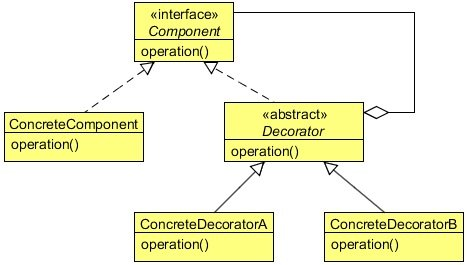

# Decorator Design Pattern

The decorator design pattern allows us to dynamically add functionality and behavior to an object without affecting the behavior of other existing objects in the same class. 
We use inheritance to extend the behavior of the class.
Decorator design patterns allow us to add functionality to an object (not the class) at runtime, and we can apply this customized functionality to an individual object based on our requirement and choice.
 
 